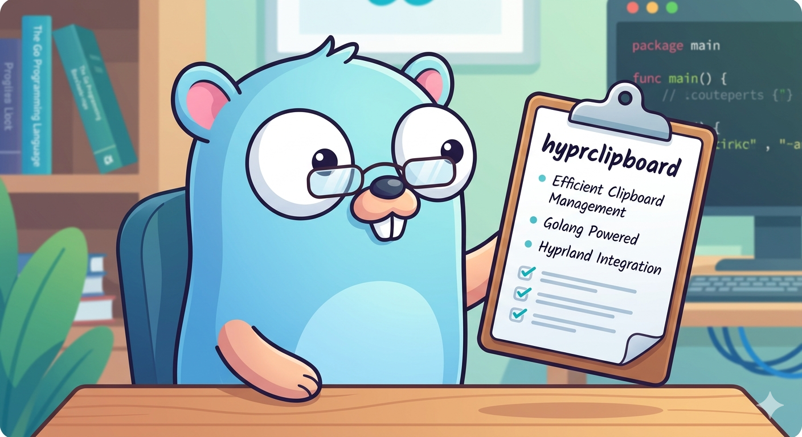

# HyprClip



HyprClip is a clipboard manager for Wayland, written in Go. It tracks your clipboard History in a JSON file and uses `wofi` to provide a searchable, graphical menu.

---

## Features

- **Native Wayland Support:** Built specifically for Wayland compositors like Hyprland.
- **History:** Automatically tracks your clipboard, stores the last 20 entries.
- **De-duplication:** Moves existing entries to the top instead of creating duplicates.
- **Fuzzy Search:** Integration with `wofi` for quick searching through your history and quick open.
- **JSON Storage:** Keeps your data structured and accessible in `~/.config/cliphist/`.

## Installation

1. **Clone the repository:**

   ```bash
   git clone https://github.com/Tiago080404/hyprclipboard.git
   cd hyperclipboard
   ```

2. **Build the binary:**
   ```bash
   go build -o hyprclip main.go
   ```
3. **Move it to your path for availabilty for the waybar:**
   ```bash
   sudo mv hyprclip /usr/local/bin/
   ```

## Configuration

```bash
#Go to your waybar config and paste this in there with your prefered specs(you can copy my specs)
"custom/clipboard":{
"exec": "{PATH}/clip-hist", #the path where your binary is located for me its in local/bin
"interval":5,
"format":" ",
"on-click":"{PATH}/clip-hist list" #also the path
}
#After that restart your Waybar
```

Feel free to checkout the code and to give me some feedback :)
